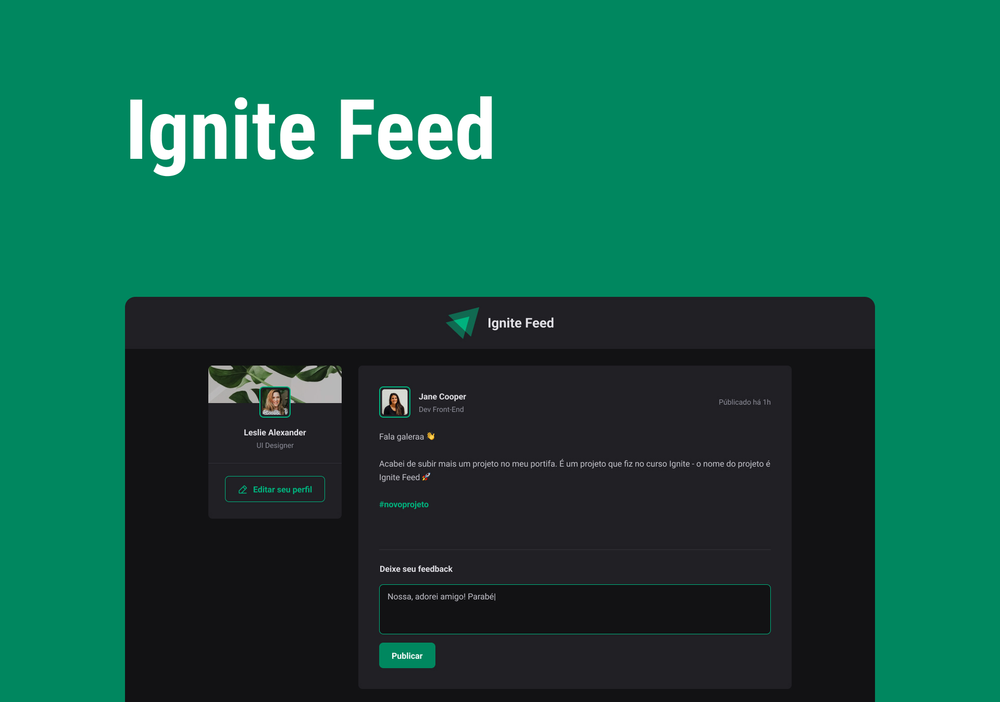

  

## 💻 Projeto

A aplicação se trata de um projeto de uma rede social. Esta, foi realizada no curso Ignite da Rockeseat.

## ✨ Tecnologia

- [TypeScript](https://www.typescriptlang.org/)
- [React](https://reactjs.org/)

## 🔖 Layout

Você pode visualizar o layout do projeto através do link abaixo:

- [Layout](<https://www.figma.com/file/LffZaJaKXg3sic0dNbGZIp/Ignite-Feed-(Community)?node-id=0%3A1&t=FNqMbXptDpE4AvuV-1>)
